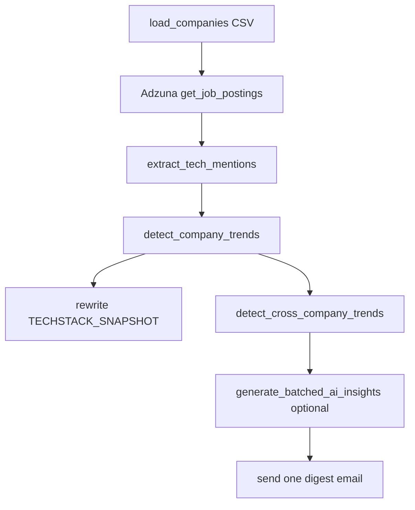

# CLAUDE.md

This file provides guidance to Claude Code (claude.ai/code) when working with code in this repository.

## Commands

```bash
# Install dependencies
pip install -r requirements.txt

# Run the earnings agent (from repo root; needs a populated .env)
python -m agents.earnings_agent.main

# Run the earnings agent smoke test (plain script, not pytest — exits non-zero on failure)
python -m agents.earnings_agent.tests.test_agent

# Manual debug scripts that hit live APIs (require valid keys in .env)
python -m agents.earnings_agent.tests.test_ai_insights
python -m agents.earnings_agent.tests.debug_insights
python -m agents.earnings_agent.tests.debug_ai_insights

# Run the ratings agent (from repo root; needs a populated .env)
python -m agents.ratings_agent.main

# Ratings agent smoke test (also runs offline change-detection checks)
python -m agents.ratings_agent.tests.test_agent

# Run the flights agent (from repo root; needs a populated .env)
python -m agents.flights_agent.main

# Flights agent smoke test (offline route-parsing + change-detection checks)
python -m agents.flights_agent.tests.test_agent

# Run the techstack agent (from repo root; needs a populated .env)
python -m agents.techstack_agent.main

# Techstack agent smoke test (offline parsing + trend-detection checks)
python -m agents.techstack_agent.tests.test_agent
```

There is no linter or pytest configured. Tests are standalone scripts with a `main()` that returns an exit code; they do not use a test framework, so run them as modules (not `pytest`).

Setup: copy `env.example` to `.env` and fill in the values. `get_settings()` raises at startup if `FINNHUB_API_KEY`, `SMTP_USER`, `SMTP_PASS`, or `EMAIL_TO` are missing.

## Architecture

This is a **monorepo of autonomous agents**. The hard rule: agent-specific business logic lives under `agents/<name>/`; all shared integration code lives under `common/`. Always import shared components rather than copying them into an agent.

### Layout
- `common/config.py` — single `Settings` dataclass loaded once via `get_settings()` (`lru_cache`). All env access goes through here; agents never call `os.getenv` directly.
- `common/clients/` — API wrappers (`FinnhubClient`, `OpenAIClient`, `TravelpayoutsClient`, `AdzunaClient`), each with built-in rate limiting.
- `common/email/sender.py` — `EmailSender`, SMTP multipart (plain + HTML).
- `common/email/templates.py` — shared inline-styled, table-based HTML helpers and escaping (`et.esc`) for email-safe rendering.
- `common/watchlist.py` — `load_tickers()` reads the `Symbol` column from the stock watchlist CSV (shared default `common/data/watchlist.csv`); `load_routes()` reads flight-route rows (`Origin,Destination,DepartMonth` + optional `ReturnMonth,MaxPrice,OneWay`) for the flights agent; `load_companies()` reads techstack rows (`Company,SearchQuery` required; optional `Ticker,Sector`).
- `agents/earnings_agent/` — `agent.py` holds `EarningsAgent`; `prompts.py` holds the LLM templates; `main.py`/`__main__.py` are the entrypoints.
- `agents/ratings_agent/` — `agent.py` holds `RatingsAgent` (analyst rating-change alerts); same `prompts.py`/`main.py`/`__main__.py` layout.
- `agents/flights_agent/` — `agent.py` holds `FlightsAgent` (flight price-drop watcher); same `prompts.py`/`main.py`/`__main__.py` layout. Does not use Finnhub.
- `agents/techstack_agent/` — `agent.py` holds `TechstackAgent` (job-posting technology trend watcher); same `prompts.py`/`main.py`/`__main__.py` layout. Uses Adzuna, not Finnhub.

### Earnings agent flow (`EarningsAgent.run`)
1. Compute `target_date` — yesterday normally, 3 days ago when `TEST_MODE=true` (wider window so local runs find data).
2. For each watchlist ticker: fetch earnings calendar + filtered company news from Finnhub. Tickers with no earnings on the date are skipped.
3. Generate AI insights via `generate_batched_ai_insights` — one batched OpenAI call for all tickers, falling back to per-ticker calls (`run_with_fallback`) on failure.
4. Build HTML + plain-text email per ticker and send one email each.

### Ratings agent flow (`RatingsAgent.run`)
1. For each watchlist ticker, fetch recommendation trends + price target from Finnhub.
2. **Recommendation change is stateless** — diff the weighted consensus score of the latest vs prior monthly period (threshold in `agent.py`); no stored state.
3. **Price-target change is stateful** — compare the current mean target against a JSON snapshot (`RATINGS_PT_SNAPSHOT`) of last-seen targets; the snapshot is rewritten every run (baselines for untouched tickers carried forward). In CI the snapshot survives ephemeral runners via `actions/cache`, so a ticker's price-target alerts begin on its second run.
4. Only changed tickers get AI insights (batched, with per-ticker fallback) and one email each. The ratings parser uses a `RATING RATIONALE` header where earnings uses `STRATEGIC ANALYSIS` — each agent owns its own `parse_structured_insights`.

### Flights agent flow (`FlightsAgent.run`)
1. Load routes via `load_routes()`; for each, fetch the current cheapest fare from the Travelpayouts/Aviasales Data API (`TravelpayoutsClient.get_cheapest_fare`, whole-month `YYYY-MM` cheapest).
2. **Two triggers** (`detect_change`, a pure function): a *target-price* hit (fare ≤ the route's `MaxPrice`, stateless) **or** a *price drop* of ≥ `FLIGHTS_PRICE_DROP_PCT` vs the last-seen fare. The drop side is **stateful** — last-seen fares are persisted to a JSON snapshot (`FLIGHTS_PRICE_SNAPSHOT`), rewritten every run with untouched baselines carried forward; in CI `actions/cache` persists it, so price-drop alerts begin on a route's second run (target-price alerts work on the first).
3. Triggered routes get AI insights (batched, per-route fallback) and are sent as **one consolidated digest email** (not one per route). Flights uses `DEAL SUMMARY`/`PRICE CONTEXT`/`BOOKING TIP` headers — its own `parse_structured_insights`.

### Techstack agent flow (`TechstackAgent.run`)



1. Load companies via `load_companies()` and fetch recent postings from Adzuna per `SearchQuery` (7 days normally, 30 days when `TEST_MODE=true`).
2. Extract technology mentions from posting title/description using regex keyword sets, then compare current mention shares against the prior snapshot (`TECHSTACK_SNAPSHOT`).
3. **Trend detection is stateful** — per company, classify each technology as `NEW`, `RISING`, or `FALLING` based on mention-share deltas and thresholds (`TECHSTACK_TREND_THRESHOLD`, default 20 points). Snapshot is rewritten every run with untouched baselines carried forward; in CI `actions/cache` persists this state between runs.
4. Group detected trends across companies into cross-company signals, generate AI insights (batched, with fallback), and send **one consolidated digest email**.
5. Techstack keeps its own prompt sections and parser (`PICKS AND SHOVELS`, `COMPETITIVE MOAT`, `LAGGARD WARNING`, `INVESTMENT THESIS`, `CONFIDENCE`) and follows the same parser-lockstep rule as the other agents.
6. If `ADZUNA_APP_ID` / `ADZUNA_APP_KEY` are unset, the agent logs a message and exits gracefully (no-op), matching the repo's fail-soft design.

### Key design points
- **AI is optional.** When `OPENAI_API_KEY` is unset, `OpenAIClient.is_enabled` is `False` and the agent still runs with non-AI fallback text. Guard any new OpenAI use behind `is_enabled`.
- **Rate limiting is client-side and stateful.** `FinnhubClient` (50/min) and `OpenAIClient` (3/min) self-throttle with `time.sleep`. `generate_individual_insights` also sleeps 10–15s between tickers. Long runtimes are expected by design.
- **AI output is unstructured text parsed by hand.** The model returns labeled sections (`EXECUTIVE SUMMARY`, `STRATEGIC ANALYSIS`, `RISK FACTORS`, `INVESTMENT RECOMMENDATION`, `EXPERT RECOMMENDATION`); `parse_structured_insights` splits on those headers. Changing the prompt headers in `prompts.py` requires updating that parser in lockstep.
- **Sector-aware prompting.** `get_company_sector` maps a ticker's Finnhub industry (with a hardcoded ticker fallback) to an "expert" persona injected into the prompt. Results cached per-run in `sector_cache`; insights cached in `insights_cache`.
- **Failures are swallowed, not raised.** Client methods catch exceptions, print a message, and return empty/`None`; callers check for falsy results. Preserve this so one bad ticker doesn't abort the run.

### Automation
`.github/workflows/earnings-agent.yml`, `.github/workflows/ratings-agent.yml`, `.github/workflows/flights-agent.yml`, and `.github/workflows/techstack-agent.yml` run daily (cron `0 5 * * *`, ~midnight ET) on Python 3.12. All config comes from GitHub Actions secrets matching the env var names. The ratings, flights, and techstack workflows each add an `actions/cache` step to persist snapshots (price targets / fares / tech mentions) between runs. Techstack additionally requires `ADZUNA_APP_ID` and `ADZUNA_APP_KEY`. Note: `get_settings()` requires `FINNHUB_API_KEY` for all agents, so flights and techstack workflows still need that secret even though those agents do not call Finnhub.

## Adding a new agent
Create `agents/<new_agent>/` with `agent.py`, `prompts.py`, `main.py`, `__main__.py`, `README.md`, and `tests/test_agent.py`; reuse `common/` modules; add a workflow under `.github/workflows/` if it needs scheduling. The `scaffold-new-agent` skill (see below) automates this scaffold.

## Claude Code infrastructure
Shared, team-checked-in config lives under `.claude/` (personal overrides go in the gitignored `.claude/settings.local.json`):
- **`.claude/settings.json`** — permission allowlist (the smoke test + read-only git) and a `deny` rule for reading `.env`. Wires the hooks below.
- **`.claude/hooks/protect-secrets.sh`** — PreToolUse guard that blocks editing/printing/`git add`-ing `.env` (defense-in-depth for the `deny` rule). `env.example` stays readable.
- **`.claude/hooks/prompts-parser-reminder.sh`** — PostToolUse reminder, on edits to any `agents/*/prompts.py`, that the section headers are parsed by hand and must change in lockstep with `parse_structured_insights`.
- **`.claude/skills/scaffold-new-agent/`** — skill that scaffolds a new agent per the convention above, reusing `common/`.
- **`.claude/skills/sync-prompts-parser/`** — skill that diffs the section headers declared in an agent's `prompts.py` against the `parse_structured_insights` branches in `agent.py`, flags drift, and fixes the parser (plus result/fallback dict keys and the docstring) in lockstep. Complements the `prompts-parser-reminder` hook, which only reminds.
- **`.claude/skills/add-agent-config/`** — skill that adds a config var end-to-end across the `Settings` dataclass + `get_settings()` in `common/config.py`, `env.example`, and the agent's `.github/workflows/*.yml` (with an `actions/cache` step for snapshot paths), handling required-vs-optional and casts.
- **`.claude/skills/run-agent-locally/`** — skill that exercises an agent the safe way: runs its offline `tests/test_agent` smoke test by default, and only does a live `python -m agents.<name>.main` run (which sends real email) on explicit request, with the `TEST_MODE` and AI-optional caveats.
- **`.claude/skills/format-agent-email/`** — skill that redesigns an agent email using `common/email/templates.py` helpers (inline CSS, table layout, escaped dynamic content via `et.esc`) for Gmail/Outlook-safe rendering.
- **Worktrees** — `scripts/worktree.sh <branch>` creates a bootstrapped sibling worktree (own `venv` + copied `.env`) for parallel sessions; see `.claude/WORKTREES.md`.
